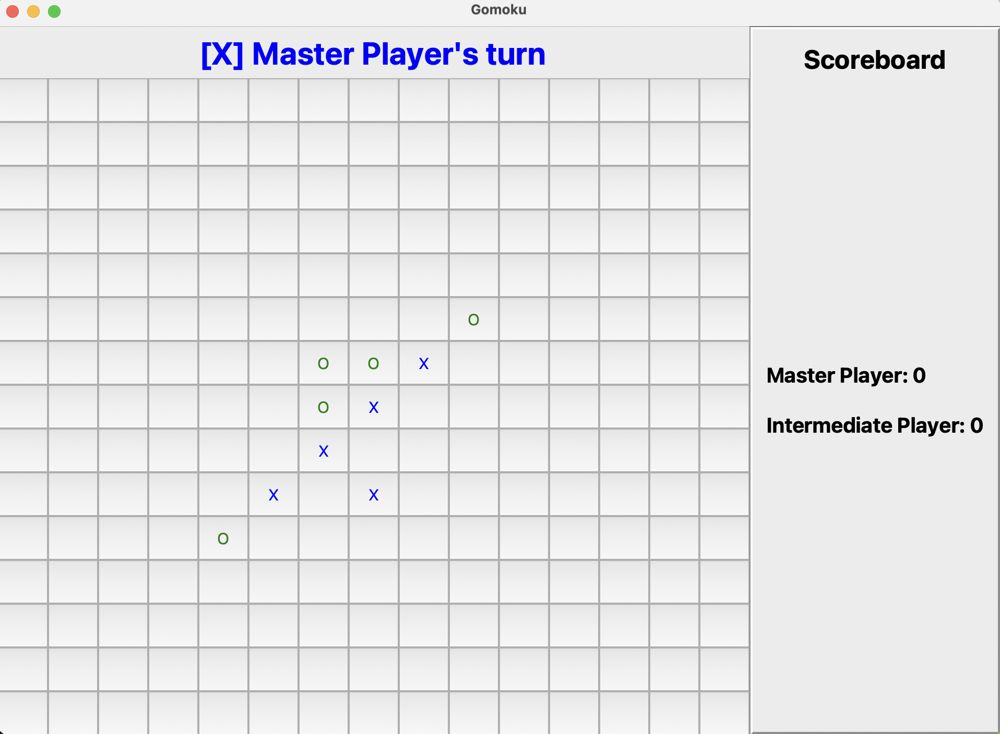

# Gomoku
## Project Introduction

In this project, I implemented various AI algorithms for Gomoku, an extension of Tic Tac Toe. I have also completed a previous project on Tic Tac Toe, which can be found here: [COMP2050_TicTacToe](https://github.com/Thanh-WuTan/COMP2050_TicTacToe). 

<p align="center">
  
</p>


## Set up Environment
To set up the environment for this project, follow these steps: 
1. Install and setup [conda](https://docs.anaconda.com/free/miniconda/#quick-command-line-install).
2. Create environment.
```
conda create --name tictactoe python=3.8.19
conda activate tictactoe
pip install -r requirements.txt
```

## Project Structure

* [game.py](project/game.py): Contains the core game logic.
* [gameplay.py](project/gameplay.py): Manages game interactions between players, including both AI and human players.
* [player.py](project/player.py): Defines an abstract class from which custom agents will be implemented.
* [gomoku](project/gomoku): Contains the AI agents that are to be developed and customized.
* [bots](project/gomoku/bots): Includes pre-built Gomoku bots that can be used to evaluate the performance of agents.

## Command-Line Usage

1. Example usage
```
python main.py -p1 master -p2 intermediate -n 4 -m ui
```
2. Options
```
python main.py -p1 [PLAYER_1] -p2 [PLAYER_2] -m [VISUALIZATION] -n [NUM_GAMES] -t [TIMEOUT] -s [SIZE]
```

+ `--player1` or `-p1` : Choose player 1.
+ `--player1` or `-p1` : Choose player 2.
    + Choices of player: 'minimax', 'alphabeta', 'mcts', 'qlearning', 'human', 'random'.
+ `--mode` or `-m` : Choose visualization mode ('silent', 'plain', or 'ui'). 
    + 'silent' only shows game result (not possible for human player). 
    + 'plain' shows the game state in terminal. 
    + 'ui' shows the game with integrated UI.

+ `--num_games` or `-n` : Number of games for evaluations. Not that players will be assigned 'X' and 'O' alternately between games.
+ `--timeout` or `-t` : Set timeout for each AI move. No timeout is set for Human move. Default is 10 seconds per move.
+ `--no_timeout` or `-nt` :  No timeout for AI move.
+ `--size` or `-s` : Size of the board for Gomoku (default=15).
+ `--load` or `-l` : Load the Q table for Tabular Q-Learning agent, for weights for the features in Approximate Q-Learning agent. You should give only the file name of the weight to this argument.
+ `--no_train` : No training for Q-Learning agents.

3. Evaluation
```
python evaluation.py -p [PLAYER] 
```

To evaluate AI agents using hand-crafted [test cases](project/evaluation.py), the output of the evaluation is saved in the [evaluation](evaluation) folder.  
* `--load` or `-l`: Loads the Q table for the Tabular Q-Learning agent or weights for the features in the Approximate Q-Learning agent. Only the file name of the weights should be provided for this argument.  
* `--no_train`: Disables training for the Q-Learning agents.
